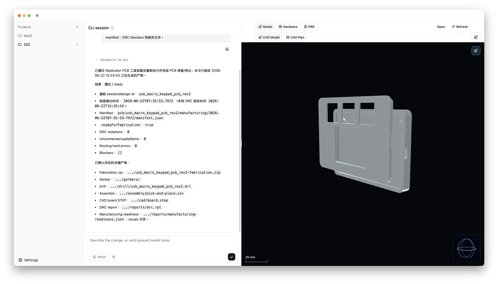
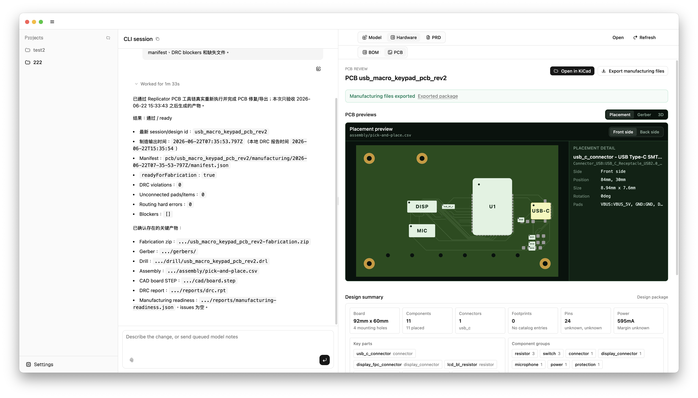
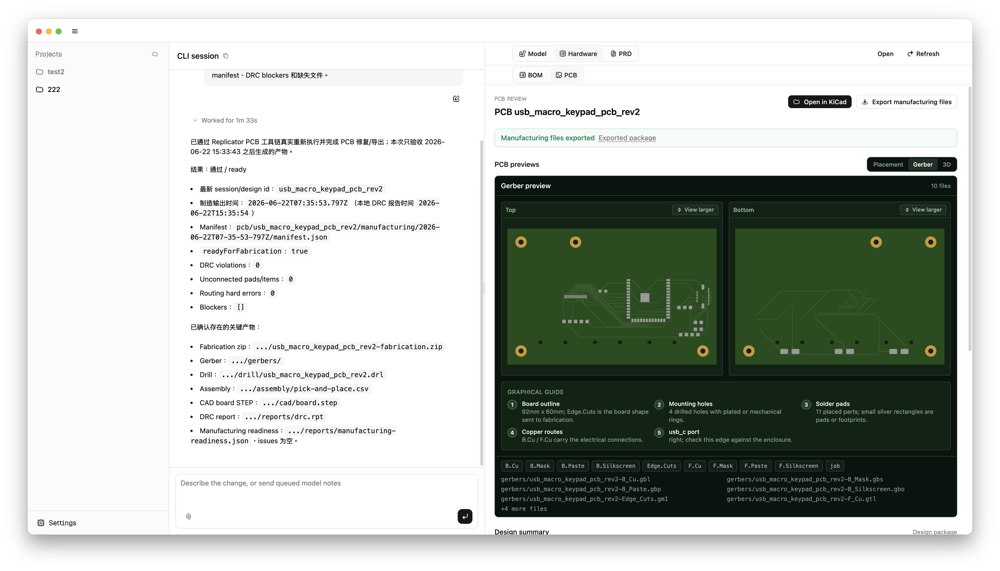

  

<h1 align="center">Replicator</h1>

  <strong>物理プロダクトのための Codex。</strong>

  ハードウェアのアイデアを、機構・電気・PCB・製造まで進められる試作計画にします。

  <a href="./README.md">English</a> |
  <a href="./README.zh-CN.md">简体中文</a> |
  <a href="./README.ja.md">日本語</a>

  <a href="https://github.com/XONAR-LABS/replicator-release/releases/latest">最新の macOS リリースをダウンロード</a>

> [!IMPORTANT]
> 現在の公開ビルドは **macOS Apple Silicon** 向けです。
> Windows、Linux、Intel macOS、Universal macOS 版はまだ公開されていません。

 

## Replicator とは？

Replicator は、物理プロダクトやハードウェア試作のための AI ワークスペースです。

作りたいものを説明すると、Replicator がアイデアを前に進めます。製品プランの整理、実現方法の分解、部品選定、機構設計、電気・PCB まわりの検討、製造用ファイルの準備、次に取るべき試作・製造ステップまで支援します。

創業者、メイカー、ハードウェアチーム、プロダクトチームが、設計ツール、製造サービス、スプレッドシート、デバイス操作を行き来する時間を減らすためのアプリです。

## スクリーンショット

  

  

  

## Replicator ができること

- 製品アイデアを、実行しやすい開発プランに整理します。
- AI プロダクトエンジニアのように、機能、制約、部品、コスト、次の作業を一緒に検討します。
- 機構、電気設計、PCB 計画、試作上の制約を 1 つの流れで整理します。
- 試作に必要な設計、電気、製造用の受け渡し資料を準備します。
- 生成ファイル、判断内容、変更履歴を 1 つのローカルプロジェクトにまとめます。
- 対応しているワークフローでは、JLCPCB や Huaqiu などの製造サービスに渡すための資料準備を支援します。
- 対応しているワークフローでは、Bambu Lab などのデスクトップ製造デバイスに向けた作業も支援します。

Replicator は単なる作図ツールではありません。「これを作りたい」というアイデアから、「試作できる、発注できる、製造できる」状態までの実務を支援します。

## インストール

1. [最新リリース](https://github.com/XONAR-LABS/replicator-release/releases/latest)を開きます。
2. `.dmg` ファイルをダウンロードします。
3. ディスクイメージを開き、**Replicator** を **Applications** にドラッグします。
4. Replicator を起動し、プロジェクトフォルダを作成または開きます。

リリースページには `.zip`、`.blockmap`、`latest-mac.yml` が含まれる場合があります。通常のインストールには `.dmg` を使用してください。その他のファイルはアップデートやリリース情報のためのものです。

> [!NOTE]
> 初回起動には時間がかかる場合があります。Replicator がローカルの製造実行環境を準備するためです。セットアップが完了するまでアプリを開いたままにしてください。

## 動作要件

- Apple Silicon 搭載 Mac
- ダウンロード、初回セットアップ、AI モデル呼び出しのためのインターネット接続
- 使用するワークフローに応じて、モデルプロバイダーの設定または Codex アプリとの接続

より良い結果を得るには、推論能力の高いモデルの使用をおすすめします。

## プライバシーとローカルファイル

Replicator は、選択したプロジェクトフォルダにプロジェクトファイルを保存します。生成ファイル、成果物、プロジェクトログは、自分で共有または同期しない限りローカルマシン上に残ります。

AI モデルへのリクエストは、ユーザーが設定したモデルプロバイダーに送信されます。

## サポート

不具合やリリースに関する問題がある場合は、
[Replicator release repository](https://github.com/XONAR-LABS/replicator-release/issues)
に issue を作成してください。アプリのバージョン、macOS のバージョン、実行しようとしていた操作、関連するエラーメッセージを含めてください。

## リリースノート

各 GitHub release には、バージョンごとのアプリファイルとリリースノートが含まれます。変更点、修正、既知の制限については、ダウンロードするバージョンの release notes を確認してください。
