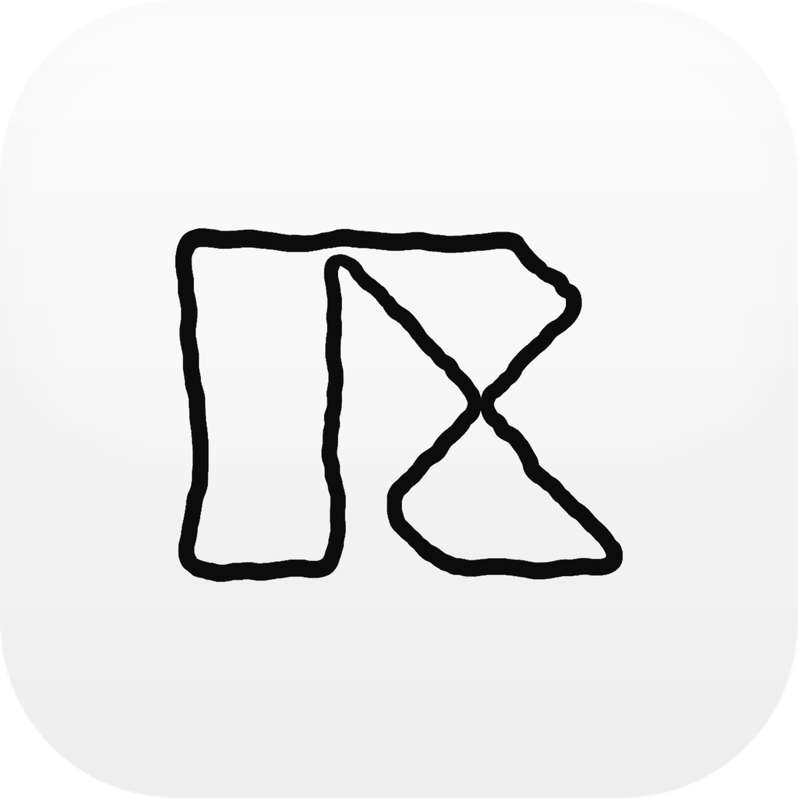
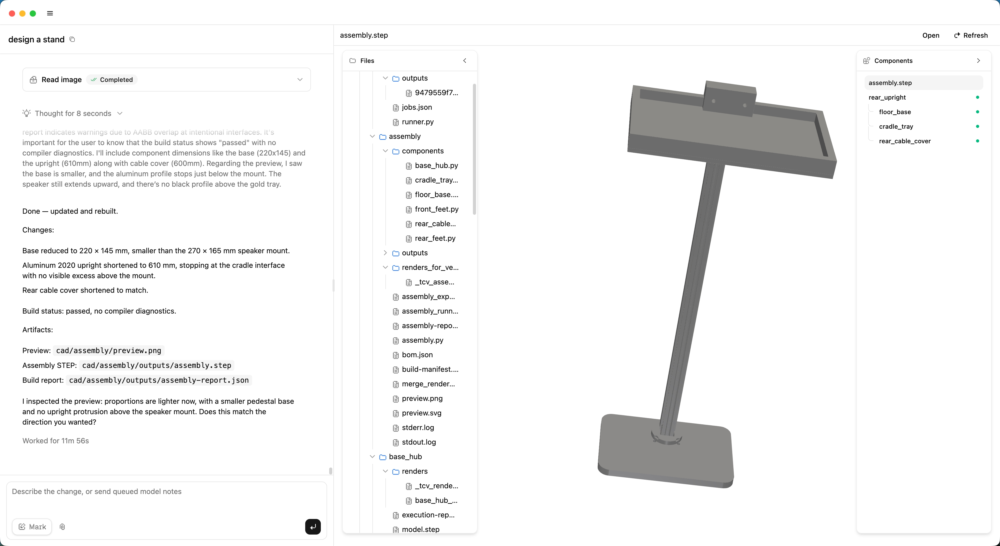

<p align="center">
  
</p>

<h1 align="center">Replicator</h1>

<p align="center">
  AI-native desktop workspace for product design and mechanical CAD.
</p>

<p align="center">
  <a href="https://github.com/XONAR-LABS/replicator-release/releases/latest">Download the latest macOS release</a>
</p>

> In _Star Trek_, a
> [replicator](<https://en.wikipedia.org/wiki/Replicator_(Star_Trek)>) is a
> machine that can create (and recycle) things.

Replicator helps product teams and makers turn rough ideas into structured
design work: conversations, project files, CAD plans, generated artifacts, and
iteration history all live inside a local project folder.

> [!IMPORTANT]
> Current public builds target **macOS Apple Silicon**. Windows, Linux, Intel
> macOS, and Universal macOS builds are not published yet.

<br>

## Screenshots

<!-- Replace these placeholder PNG files with real screenshots when ready. -->



_Main interface: chat with the design agent, project context, and generated work
in one desktop window._

<br>

## Highlights

- **Design with an AI agent** - explore product ideas, constraints, components,
  and next steps in one workspace.
- **Generate CAD artifacts** - create and iterate on Build123d-based mechanical
  design outputs.
- **Keep work local** - store projects as normal folders on your Mac.
- **Connect your Codex app** - reuse your existing Codex authentication when
  available.

<br>

## Install

1. Open the
   [latest release](https://github.com/XONAR-LABS/replicator-release/releases/latest).
2. Download the `.dmg` asset.
3. Open the disk image and drag **Replicator** into **Applications**.
4. Launch Replicator and create or open a project folder.

Release pages may also include `.zip`, `.blockmap`, and `latest-mac.yml` files.
Most users should install from the `.dmg`; the other files support packaged
updates and release metadata.

> [!NOTE]
> The first launch may take longer because Replicator prepares its CAD runtime
> in your macOS application data directory. Keep the app open until setup
> finishes.

<br>

## Requirements

- Mac with Apple Silicon
- Internet access for download, first-run runtime setup, and model-provider API
  calls
- A configured model provider or connected Codex app, depending on the workflows
  you use

For best results, we recommend using GPT-5.5 where available.

<br>

## Connect your Codex app

If you already use Codex on this Mac, Replicator can connect to your existing
Codex authentication. In common setups, that authentication is stored in:

```text
~/.codex/auth.json
```

To use this path, sign in to Codex first, then open Replicator and check the
Codex connection status in the app settings.

Replicator looks for the `codex` executable in common locations such as
Homebrew, `/usr/local/bin`, your shell `PATH`, and the Codex desktop app bundle.
If your Codex setup uses a custom home directory, make sure Replicator is
launched with the same Codex home configuration.

<br>

## Privacy and local data

Replicator stores project state locally in the project directory you choose.
Provider credentials are stored through the app settings layer and are not meant
to be committed into project files.

Model requests are sent to the model provider you configure. Generated files,
CAD artifacts, and project logs remain on your machine unless you share or sync
the project folder yourself.

<br>

## Updating

Replicator supports checking for updates inside the app. Open the update
controls from the app settings to check for a new version, download it, and
restart into the updated build when it is ready.

By default, packaged builds check for updates automatically but wait for you to
choose when to download and install them.

You can still install manually by downloading a newer `.dmg` from the
[releases page](https://github.com/XONAR-LABS/replicator-release/releases) and
replacing the existing app in **Applications**. Your project folders are
separate from the application bundle.

<br>

## Troubleshooting

**macOS says the app cannot be opened.**

- Open **System Settings > Privacy & Security**.
- Allow Replicator if macOS blocked the first launch.

**First launch is slow.**

- Replicator may be provisioning its CAD runtime.
- This is expected on a fresh install or after a runtime update.
- Keep the app open until setup finishes.

**CAD generation fails.**

- Use the current macOS Apple Silicon build.
- Let Replicator complete first-run setup before generating CAD artifacts.
- Reopen the app if setup finished but CAD tools are still unavailable.

**A model request fails.**

- Open the app settings.
- Verify your provider credentials.
- Confirm that the selected model is available from your provider.

**Codex connection is not detected.**

- Confirm that Codex is installed and signed in on this Mac.
- Reopen Replicator and check the app settings.
- If you use a custom Codex home, launch Replicator with the same configuration.

<br>

## Support

Found a bug or need help with a release? Please open an issue in the
[Replicator release repository](https://github.com/XONAR-LABS/replicator-release/issues)
with your app version, macOS version, what you were trying to do, and any
relevant error message.

<br>

## Thanks

Replicator stands on the work of many open-source projects, including:

- [Electron](https://www.electronjs.org/)
- [React](https://react.dev/)
- [Vite](https://vite.dev/)
- [Build123d](https://github.com/gumyr/build123d)

<br>

## Release notes

Each GitHub release includes the versioned app assets and generated release
notes. For changes, fixes, and known limitations, read the notes attached to the
specific version you download.
